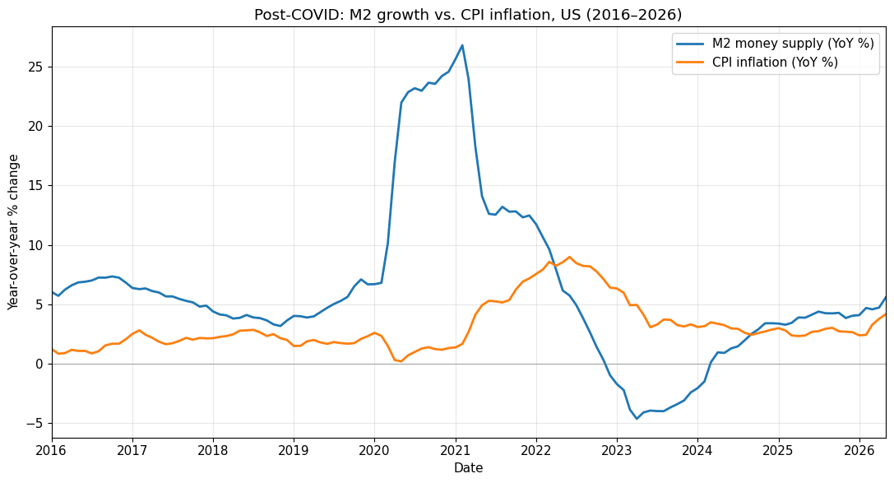

# M2 Money Supply Growth and CPI Inflation: A Monetarist Lag Analysis (US, 2016–2026)

**Author:** Sid
**Date:** July 2026
**Subject:** IB Economics HL

## Abstract

This paper looks at the relationship between year-over-year M2 money supply growth and CPI inflation in the United States from 2016 to 2026, focusing on the post-COVID monetary expansion. The data shows a transmission lag that lines up with monetarist predictions, but the relationship isn't mechanical, and money supply alone can't explain inflation outcomes.

## 1. What the Data Shows

### Identifying the Peaks

M2 growth hit roughly 27% YoY around February 2021, fuelled by Fed asset purchases and direct fiscal stimulus through the CARES Act, PPP loans, and enhanced unemployment benefits. CPI inflation then peaked at about 9.1% YoY in June 2022, reflecting the delayed pass-through of that monetary expansion alongside supply-chain disruptions and energy price shocks after Russia invaded Ukraine. That puts the lag between the two peaks at approximately 16 months.

### The Contraction

The other side of the story is just as telling. M2 growth turned negative by late 2022, bottoming out near −4.5% YoY by mid-2023. This was the first sustained contraction in modern US monetary history. CPI inflation followed it down, falling from 9% to around 3% by late 2023, again with a roughly 12 to 15 month delay. By 2025 and into 2026, M2 has recovered to about 5% YoY growth and CPI has settled in the 2.5 to 3% range.

## 2. Does This Fit Monetarist Theory?

Friedman's classic claim is that monetary policy operates with "long and variable lags," usually estimated at 12 to 18 months for the transmission from money supply changes to consumer prices. The 16-month gap observed here sits right in that window.

But the magnitude tells a different story. M2 grew 27% at its peak, yet CPI only reached 9%. A crude reading of the quantity theory (MV = PY) would predict much higher inflation. The gap can be explained by a few things. First, households saved a large portion of their stimulus payments rather than spending them, which dragged down the velocity of money. Second, a lot of the excess liquidity ended up in equities, housing, and crypto rather than flowing into consumer goods. Third, real GDP was rebounding sharply from the COVID trough, so part of the nominal demand increase was absorbed by actual output growth rather than price increases.

## 3. What the Correlation Tells Us

Visually, the two series show a moderate-to-strong positive correlation when you shift M2 forward by 12 to 18 months. On the expansion side from 2020 to 2022, the co-movement is hard to miss: CPI's inflection points track M2's inflection points with a consistent offset. During the quieter pre-COVID years from 2016 to 2019, the link is much weaker. M2 was growing at 4 to 7% and CPI just sat near 2%, suggesting that in a "normal" policy regime, expectations and supply conditions matter more than the money supply.

This points to something non-linear. Monetary expansion becomes inflationary mainly when it's large and fast enough to overwhelm the economy's capacity to absorb it. It doesn't operate as a smooth, proportional mechanism at all times.

## 4. Counterarguments

### The Eurozone and Japan Puzzle

Both the ECB and the Bank of Japan ran aggressive monetary expansion in 2020 and 2021, with M2 growth rates in a similar ballpark to the US. Yet their inflation outcomes were very different. Eurozone CPI peaked at around 10.6%, but that was driven mostly by energy costs, not domestic demand. Japanese CPI peaked at just 4.3%. If M2 growth were really the primary driver, Japan should have seen far more inflation than it did. The difference likely comes down to how the money reached the real economy. The US sent cheques directly to households. Japan channelled funds through corporate lending facilities. Labour markets matter too: American wages are flexible and responded quickly, while Japanese wages stayed rigid.

### Supply Shocks

You can't pin the June 2022 CPI peak on monetary factors alone. Energy prices spiked after Russia's invasion of Ukraine, semiconductor shortages persisted, shipping was still bottlenecked, and food prices surged because Ukraine is a major grain exporter. If you decompose CPI into core and headline, core inflation peaked later and lower, which suggests at least 2 to 3 percentage points of the headline peak came from supply-side forces rather than demand.

### Expectations and Fed Credibility

The speed of disinflation from 9% down to 3% was faster than most monetarist models would have predicted. That probably owes more to the Fed's credibility in signalling aggressive rate hikes than to the mechanical shrinkage of M2. Long-term inflation expectations (measured by 5Y5Y breakevens) stayed anchored near 2.3% throughout the entire episode. Markets never truly priced in persistent, runaway inflation. That's hard to square with a purely monetarist framework.

## 5. Conclusion

The US data from 2016 to 2026 gives qualified support to the monetarist transmission story. The lag structure matches Friedman's 12 to 18 month estimate, and the directional relationship during extreme episodes is clear. But the magnitude mismatch, the cross-country variation, and the obvious role of supply shocks and expectations all show that M2 growth is a necessary but insufficient condition for sustained inflation. The post-COVID episode is best understood as a collision of monetary, fiscal, and supply-side forces rather than proof of any single theory.

## Chart

## References

Friedman, M. (1961). *The Lag in Effect of Monetary Policy*. Journal of Political Economy.

Federal Reserve Economic Data (FRED). M2 Money Stock, Consumer Price Index.

ECB Statistical Data Warehouse. M2 aggregates, HICP.

Bank of Japan. Monetary Base and CPI statistics.
